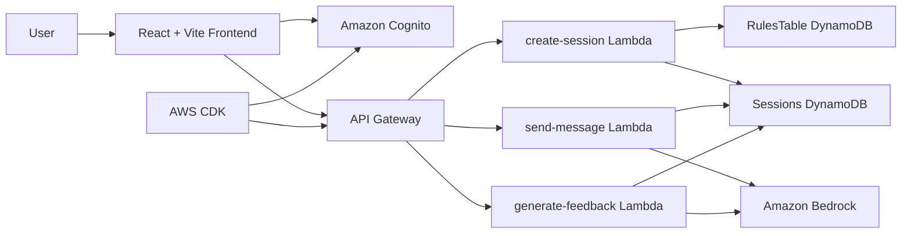

# NeuroBridge

> Practice difficult moments before they happen.

NeuroBridge is a practice platform for rehearsing difficult social and professional conversations in a safer, lower-pressure environment. It uses AWS Bedrock (Nova 2 Lite) for realistic conversational roleplay and objective communication feedback.

## Key Features

- **React + TypeScript frontend** built with Vite.
- **Modern authentication UI** with Amazon Cognito (sign-in, sign-up, verification).
- **Animated WebGL aurora background** using `ogl`.
- **AWS CDK infrastructure** (Cognito, API Gateway, Lambda, DynamoDB, S3).
- **Backend Lambda endpoints** (`create-session`, `get-session`, `send-message`, `generate-feedback`).
- **AI roleplay via Bedrock Nova 2 Lite** with strict safety guardrails.
- **Voice input/output** using the native browser Web Speech API.
- **Real AI feedback and scoring** via an objective Bedrock evaluation prompt.
- **XP and progress tracking** (localStorage).
- **Cost guardrails**: 30 message cap per session, 300 token output limit, 10 message history window.

## Architecture



## Tech Stack

- React 19, TypeScript, Vite, OGL
- Amazon Cognito Identity JS
- AWS CDK v2
- API Gateway, AWS Lambda, DynamoDB, S3
- Amazon Bedrock (Nova 2 Lite)

## Getting Started

### Prerequisites

- Node.js 20+
- AWS account and credentials (configured locally via AWS CLI or CloudShell)

### Deploy Infrastructure

```bash
cd infra
npm install
npx cdk deploy
```

After deployment, note the outputs and update your `.env` file in the project root:

```env
VITE_AWS_REGION=ap-south-1
VITE_COGNITO_USER_POOL_ID=your_user_pool_id
VITE_COGNITO_APP_CLIENT_ID=your_app_client_id
VITE_API_GATEWAY_URL=your_api_gateway_url
```

### Seed Scenario Data

Scenario data with prompt templates is defined in `backend/scripts/seed-scenarios.ts`. Seed it into DynamoDB:

```bash
npm run seed
```

### Run Locally

```bash
npm install
npm run dev
```

Open `http://localhost:5173`. Useful routes: `/login`, `/signup`, `/app`.

## Roadmap / Later

- Production error handling and loading states.
- Tune AI Partner prompts based on real test sessions.
- Migrate XP/Progress tracking from localStorage to DynamoDB.
- Google OAuth via Cognito Hosted UI.
