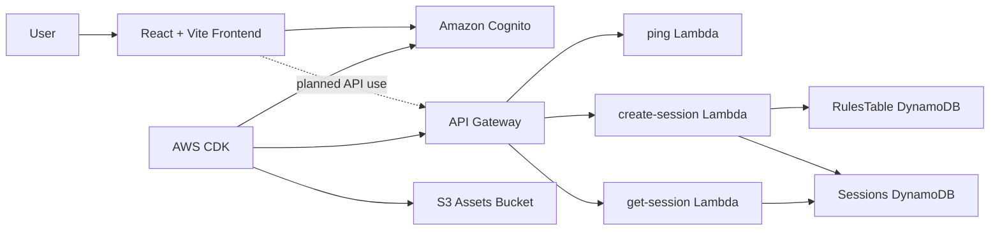

# NeuroBridge

> Practice difficult moments before they happen.

NeuroBridge is a hackathon-stage practice platform for rehearsing difficult social and professional conversations in a safer, lower-pressure environment. The current repository includes a polished React authentication experience, Cognito-backed sign-in/sign-up, AWS CDK infrastructure, and early backend session APIs that lay the groundwork for future scenario-based practice.

## Why NeuroBridge?

Difficult conversations can be hard to approach when the first attempt happens in real life. NeuroBridge is designed around a simple idea: give people a private space to prepare, make mistakes, and build confidence before important moments like interviews, boundary-setting, asking for help, or handling conflict.

The long-term product vision is an AI-powered rehearsal environment with roleplay, feedback, retries, and progress tracking. This repository currently implements the foundation for that experience.

## Key Features

### Implemented

- **React + TypeScript frontend** built with Vite.
- **Modern authentication UI** with login and signup pages.
- **Amazon Cognito authentication** using `amazon-cognito-identity-js`.
- **Email verification flow** after signup through Cognito confirmation codes.
- **In-memory auth state** through React context.
- **Minimal protected app route** at `/app` after successful sign-in.
- **Animated WebGL aurora background** using `ogl`.
- **AWS CDK infrastructure** for Cognito, API Gateway, Lambda, DynamoDB, and S3.
- **Backend Lambda handlers** for creating and fetching practice sessions.
- **DynamoDB data model types** for scenarios, difficulty levels, sessions, and messages.

### Planned

- AI conversation roleplay.
- Scenario selection UI.
- Multi-turn practice chat.
- Feedback and retry loops.
- Difficulty selection in the frontend.
- XP and personal progress views.
- Voice interaction.
- Personalized practice recommendations.
- Google OAuth through Cognito Hosted UI.

## How It Works

Current user flow:

```text
User
  |
  v
Login or create account
  |
  v
Cognito authentication / email verification
  |
  v
React auth context stores tokens in memory
  |
  v
Authenticated user lands on /app
```

Current backend session API flow:

```text
Client request
  |
  v
API Gateway
  |
  v
Lambda
  |
  v
DynamoDB Sessions / RulesTable
```

The frontend authentication flow is implemented. The backend session APIs exist, but the current React UI does not yet call them.

## Architecture



### Frontend

- `src/App.tsx` contains a small browser-history based route switch for `/login`, `/signup`, and `/app`.
- `src/components/LoginPage.tsx` handles email/password sign-in.
- `src/components/SignupPage.tsx` handles account creation and confirmation-code verification.
- `src/context/AuthContext.tsx` stores authenticated user data in React state.
- `src/components/Aurora.tsx` renders the animated WebGL background.

### Backend and Infrastructure

The `infra` folder contains an AWS CDK v2 stack that defines:

- **Amazon Cognito User Pool** with email sign-in and self sign-up.
- **Cognito App Client** with `USER_PASSWORD_AUTH` enabled.
- **API Gateway REST API** with CORS enabled for development.
- **Lambda functions**
  - `POST /ping`
  - `POST /sessions`
  - `GET /sessions/{sessionId}`
- **DynamoDB tables**
  - `Sessions`
  - `RulesTable`
  - `Progress`
- **Private S3 bucket** for future assets.

The backend Lambda code lives under `backend/lambdas`.

## Tech Stack

- React 19
- TypeScript
- Vite
- OGL
- Amazon Cognito Identity JS
- AWS CDK v2
- API Gateway
- AWS Lambda
- DynamoDB
- S3
- Oxlint

## Getting Started

### Prerequisites

- Node.js 20 or newer
- npm
- AWS account and credentials, only if deploying infrastructure
- AWS CDK CLI, only if deploying infrastructure

### Install

```bash
npm install
```

### Environment Variables

Create a `.env` file in the project root:

```env
VITE_AWS_REGION=ap-south-1
VITE_COGNITO_USER_POOL_ID=your_user_pool_id
VITE_COGNITO_APP_CLIENT_ID=your_app_client_id
VITE_API_GATEWAY_URL=your_api_gateway_url
```

`VITE_API_GATEWAY_URL` is defined in config but is not currently used by the frontend.

### Run Locally

```bash
npm run dev
```

Open the Vite URL shown in your terminal, usually:

```text
http://localhost:5173
```

Useful routes:

- `/login`
- `/signup`
- `/app`

### Build

```bash
npm run build
```

### Lint

```bash
npm run lint
```

## Deploying Infrastructure

Infrastructure commands are run from the `infra` directory:

```bash
cd infra
npm install
npx cdk synth
npx cdk deploy
```

After deployment, copy the CDK outputs into the root `.env` file:

- `CognitoUserPoolId` -> `VITE_COGNITO_USER_POOL_ID`
- `CognitoAppClientId` -> `VITE_COGNITO_APP_CLIENT_ID`
- `ApiGatewayInvokeUrl` -> `VITE_API_GATEWAY_URL`

The stack is configured for hackathon/dev use. Stateful resources use `RemovalPolicy.DESTROY`, and API CORS is open for faster iteration.

## Current Limitations

- The authenticated `/app` page is currently a minimal signed-in state, not the full practice environment.
- The session APIs are implemented but not connected to the frontend.
- `RulesTable` requires scenario rule data for meaningful session openings.
- No AI model integration is currently implemented.
- No production OAuth provider is configured; the Google button is disabled.
- Tokens are stored in memory, so refreshing the page clears the client auth state.

## Roadmap

- Connect the frontend to the session APIs.
- Build scenario and difficulty selection.
- Add AI-powered conversation roleplay.
- Add structured feedback and retry loops.
- Add progress tracking and XP views.
- Add optional voice mode.
- Configure Cognito Hosted UI with Google OAuth.
- Tighten CORS and resource policies for production.

## License

No license file is currently included in this repository.
