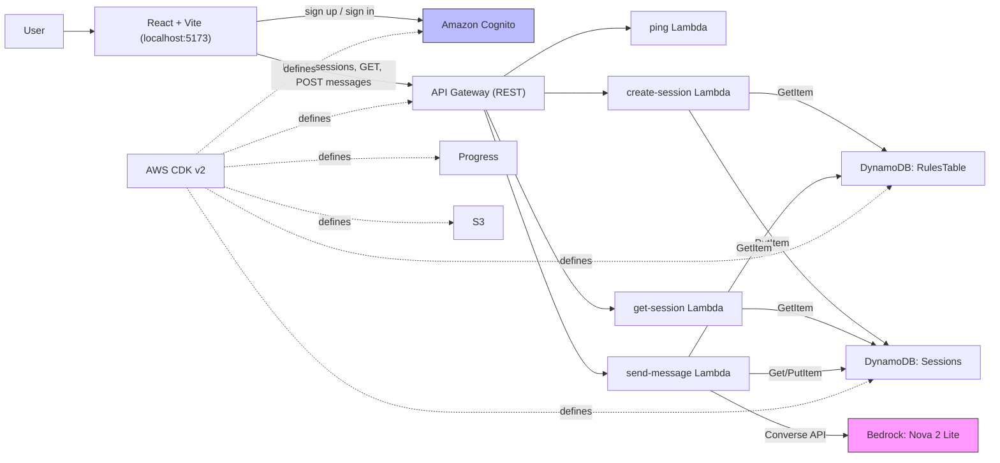

# Architecture

_How the pieces connect. BUILT = working today. PLANNED = not yet implemented._

## System Diagram

## Components

| Component | Tech | Status |
|-----------|------|--------|
| Frontend SPA | React 19 + TypeScript + Vite | ✅ BUILT |
| Auth | Cognito (email/password, USER_PASSWORD_AUTH) | ✅ BUILT |
| API | API Gateway REST, 4 routes | ✅ BUILT |
| Session logic | 3 Node.js 20 Lambdas (ARM64, 128MB) | ✅ BUILT |
| AI roleplay | Bedrock Converse API, Nova 2 Lite, 256MB Lambda | ✅ BUILT |
| Data | DynamoDB (Sessions, RulesTable) | ✅ BUILT |
| Progress data | DynamoDB Progress table | PLANNED (exists, unused) |
| Progress tracking | localStorage XP/streaks | ✅ BUILT (client-only) |
| Voice I/O | Browser Web Speech API | ✅ BUILT |
| Assets bucket | S3 (private, encrypted) | ✅ BUILT (empty) |
| API auth | Cognito authorizer on API Gateway | PLANNED |
| Google OAuth | Cognito Hosted UI | PLANNED |
| Real scoring | AI-generated feedback analysis | PLANNED |
| Scenario UI | Difficulty picker in frontend | ✅ BUILT |

## Data Flow
1. User signs up/in → Cognito returns JWT tokens → stored in React state (memory only).
2. User picks a scenario → frontend calls `POST /sessions` → Lambda looks up rules from RulesTable, creates session with AI opening line in Sessions table.
3. User types a message → frontend calls `POST /sessions/{id}/messages` → Lambda fetches session + rules, sends last 10 messages to Bedrock, appends AI reply, saves to Sessions.
4. User clicks "Complete" → frontend generates a random score (placeholder), records XP in localStorage.
